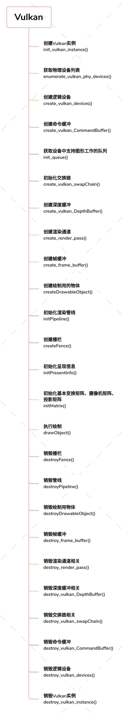

# DeeperVulkan

##### 本项目是DeeperAndroid系列之DeeperVulkan

本人通过《Vulkan开发实战详解》案例学习，并延伸拓展了基于Android平台的Vulkan开发教程

由于相比OpenGL，Vulkan深入控制硬件底层，支持多线程并发渲染，充分利用多核CPU的多线程计算资源

意味着更好的性能，更高的帧率，这在嵌入式设备或手机上意义非常重大

但随之而来的是Vulkan学习路线陡峭、流程复杂，故为了降低学习Vulkan门槛，贡献自己绵薄之力，本项目应运而生

为下一个元宇宙风口(VR、AR)，一同努力学习吧！

##### 注：本项目处在初期，内容还在持续火热更新中...

### Android NDK集成Vulkan

#### 第一次Build基本遇到如下问题

```shell
Build command failed.
Error while executing process D:\Android\SDK\cmake\3.18.1\bin\ninja.exe with arguments {-C E:\projects\Android\DeeperVulkan\app\.cxx\Debug\5l3u162n\arm64-v8a bn-vulkan-lib}
ninja: Entering directory `E:\projects\Android\DeeperVulkan\app\.cxx\Debug\5l3u162n\arm64-v8a'

ninja: error: 'D:/Android/SDK/ndk/21.4.7075529/sources/third_party/shaderc/libs/c++_static/arm64-v8a/libshaderc.a', needed by '../../../../build/intermediates/cxx/Debug/5l3u162n/obj/arm64-v8a/libbn-vulkan-lib.so', missing and no known rule to make it
```

#### 在ndk/21.4.7075529/sources/third_party/shaderc下编译命令

```shell
$ ../../../ndk-build NDK_PROJECT_PATH=. APP_BUILD_SCRIPT=Android.mk APP_ABI=all APP_PLATFORM=android-21 APP_STL=c++_static -j8 clean libshaderc_combined
```

#### 如果出现以下问题

```shell
ndk/21.4.7075529/build/gmsl/__gmsl:512: *** non-numeric second argument to 'wordlist' function: 'android=24'.  Stop.
```

#### 则修改ndk/21.4.7075529/build/gmsl/__gmsl 第512行为

```ABAP
int_encode = $(__gmsl_tr1)$(wordlist 1,$(words $1),$(__gmsl_input_int))
```

#### 继续上述编译命令即可

##### 注意 Android中minSdk需要24+

### Vulkan执行流程



### 附录

#### 图形学学习资料

##### 《GAMES101-现代计算机图形学入门-闫令琪》

https://www.bilibili.com/video/BV1X7411F744?spm_id_from=333.999.0.0

##### 《Vulkan开发实战详解》


