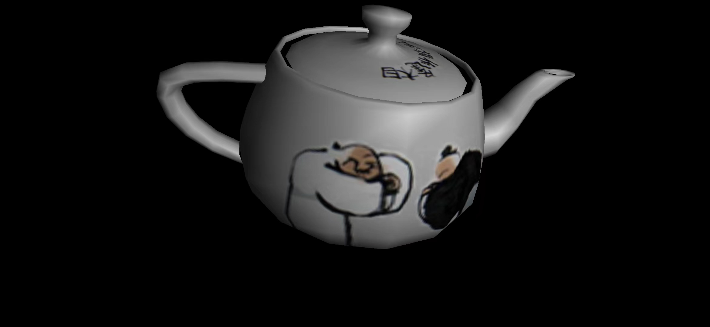

# DeeperVulkan

Samples of Compute Graphics using Vulkan API for **Android**.

## Pictures

- **Sample5_5**


- **Sample6_6**


- **Sample7_5**



## How to read

- You can see [Releases](https://github.com/JYLongKong/DeeperVulkan/releases "releases") to get milestone samples.
- You can see [Tags](https://github.com/JYLongKong/DeeperVulkan/tags "Tags") to get every single feature(towards the Releases step by step).
- You can see Sample.apk in **./apk** directory in every sample series.
- You can see pictures in **./screenshot** directory for every release.

There is some **code comments** like below to point out features or difference in the sample project.
```
vertexBinding.stride = sizeof(float) * 8;                               // Sample7_4-point+texture+normal

  /// Sample7_4 *************************************************** start
  vertexAttribs[1].binding = 0;
  vertexAttribs[1].location = 1;
  vertexAttribs[1].format = VK_FORMAT_R32G32_SFLOAT;
  vertexAttribs[1].offset = 12;
  /// Sample7_4 ***************************************************** end
```

## Draw process


## Sample List

Sample  | English Description | 中文描述
- | - | -
  Sample1_1 | First triangle | 第一个三角形
  Sample2_1 | Load SPIR-V shaders | 加载SPIR-V格式着色器
  Sample2_2 | Validate layer | 层级调试验证
  Sample4_1 | Movable triangle | 可移动的三角形
  Sample4_2 | Six-pointed star-orthogonal projection | 六角星-正交投影
  Sample4_3 | Six-pointed star-perspective projection | 六角星-透视投影
  Sample4_4 | Cube-translation transformation | 立方体-平移变换
  Sample4_5 | Cube-rotation transformation | 立方体-旋转变换
  Sample4_6 | Cube-scale transformation | 立方体-缩放变换
  Sample4_7 | Points and lines | 点与线段绘制方式
  Sample4_8 | Triangular strips and sectors | 三角条带与扇面绘制方式
  Sample4_9 | Draw belts by repeated vertex | 通过重复顶点绘制条带
  Sample4_10 | vkCmdDrawIndexed | 索引法绘制
  Sample4_11 | Different fov | 设置合理的视角
  Sample4_12 | Different NEAR cause artifact | 设置合理的投影参数
  Sample4_13 | SetDepthBias | 深度偏移
  Sample4_14 | Back cullMode | 卷绕和背面剪裁
  Sample4_15 | Indirectly draw by vertex | 顶点法间接绘制(基于Sample4_4)
  Sample4_16 | Indirectly draw by index | 索引法间接绘制(基于Sample4_10)
  Sample5_1 | Checkerboard ball | 黑白棋盘格的球
  Sample5_2 | Ambient light | 环境光照
  Sample5_3 | Diffused light | 散射光
  Sample5_4 | Specular light | 镜面光
  Sample5_5 | Ambient + Diffused + Specular | 环境光+散射光+镜面光
  Sample5_6 | Directional light | 定向光
  Sample5_7 | Surface normal vector | 立方体面法向量
  Sample5_8 | Point normal vector | 立方体点法向量
  Sample5_9 | Calculate light per fragment | 每片元计算光照
  Sample5_10 | Calculate light per vertex | 每顶点计算光照
  Sample6_1 | Texture triangle | 纹理三角形
  Sample6_2 | Flexible combination of color channels | 色彩通道的灵活组合
  Sample6_3 | Four ways to stretch texture | 四种纹理拉伸方式
  Sample6_4 | Two ways to sample texture | 两种纹理采样方式
  Sample6_5 | Mipmap texture | Mipmap纹理
  Sample6_6 | Multi-texture & procedural texture | 多重纹理与过程纹理
  Sample6_7 | Compressed texture | 压缩纹理
  Sample6_8 | Point sprites | 点精灵
  Sample6_9 | 3D texture | 3D纹理
  Sample6_10 | 2D-Array texture | 2D数组纹理
  Sample6_11 | Anisotropy | 各项异性过滤
  Sample7_1 | Load .obj file | 加载顶点与面数据的obj文件
  Sample7_2 | Calculate surface normal | 计算面法向量
  Sample7_3 | Calculate average normal | 计算平均法向量
  Sample7_4 | Load texture coordinates | 加载纹理坐标
  Sample7_5 | Load vertex normals | 加载顶点法向量


### Android NDK集成Vulkan

#### 第一次Build基本遇到如下问题

```shell
Build command failed.
Error while executing process D:\Android\SDK\cmake\3.18.1\bin\ninja.exe with arguments {-C E:\projects\Android\DeeperVulkan\app\.cxx\Debug\5l3u162n\arm64-v8a bn-vulkan-lib}
ninja: Entering directory `E:\projects\Android\DeeperVulkan\app\.cxx\Debug\5l3u162n\arm64-v8a'

ninja: error: 'D:/Android/SDK/ndk/21.4.7075529/sources/third_party/shaderc/libs/c++_static/arm64-v8a/libshaderc.a', needed by '../../../../build/intermediates/cxx/Debug/5l3u162n/obj/arm64-v8a/libbn-vulkan-lib.so', missing and no known rule to make it
```

#### 在ndk/21.4.7075529/sources/third_party/shaderc下编译命令

```shell
$ ../../../ndk-build NDK_PROJECT_PATH=. APP_BUILD_SCRIPT=Android.mk APP_ABI=all APP_PLATFORM=android-21 APP_STL=c++_static -j8 clean libshaderc_combined
```

#### 如果出现以下问题

```shell
ndk/21.4.7075529/build/gmsl/__gmsl:512: *** non-numeric second argument to 'wordlist' function: 'android=24'.  Stop.
```

#### 则修改ndk/21.4.7075529/build/gmsl/__gmsl 第512行为

```ABAP
int_encode = $(__gmsl_tr1)$(wordlist 1,$(words $1),$(__gmsl_input_int))
```

#### 继续上述编译命令即可

##### 注意 Android中minSdk需要24+

##### 《Vulkan开发实战详解》

